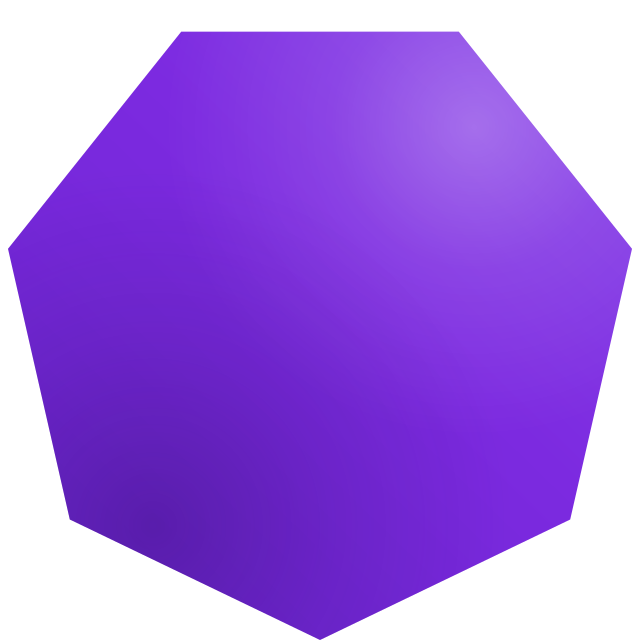

  
  <h1>Omnus</h1>
  
<strong>Your ultimate local Study Hub. Focus on what actually matters.</strong>

  
<a href="https://omnus.lolax.dev"><strong>omnus.lolax.dev</strong></a>

  

    
    
    
  

  

    
  

---

Omnus is your central workspace for structured learning and work. Manage documents, tasks, notes, and calendar in one place — built for deep productivity and a seamless experience. Use it fully local, or connect **BYO-Cloud** (your own drive) to stay in sync across devices without data loss.

> **Note:** Omnus is **proprietary** software. It is distributed via this GitHub repository (README, license, releases) but is **not** open source.

## Features

* **Spaces & Documents:** Organize courses in Spaces. Manage PDFs, learn interactively, and stay on top of everything.
* **Smart notes:** A powerful editor for all your notes and annotations.
* **Tasks & Calendar:** Never miss a deadline. Integrated task management tied to your topics.
* **AI integration (BYO-Key):** Bring your own API key to use smart AI features inside the hub — no hidden subscription fees.
* **BYO-Cloud sync:** Connect your own cloud drive and sync Omnus across machines. Your cloud, your rules — no vendor lock-in.
* **Local-first:** Works great offline on one device. Cloud sync is optional, not required.
* **Windows & macOS:** Native builds for Windows, plus macOS for **Apple Silicon** and **Intel**.
* **Focus UI:** Fullscreen-optimized learning surface for distraction-free work.

## Installation

Download the latest build for your platform from the [Releases](../../releases) tab:

| Platform | File |
|----------|------|
| **Windows** | `Omnus_0.1.1_x64-setup.exe` |
| **macOS (Apple Silicon)** | `Omnus_0.1.1_aarch64.dmg` |
| **macOS (Intel)** | `Omnus_0.1.1_x64.dmg` |

1. Download the build that matches your OS and chip.
2. Install / open the app.
3. (Optional) Add your AI API key in Settings — **BYO-Key**.
4. (Optional) Connect your own cloud drive in Settings — **BYO-Cloud** — to sync across devices.

Website: [omnus.lolax.dev](https://omnus.lolax.dev)

Builds are currently unsigned. Windows SmartScreen or macOS Gatekeeper may show a security warning on first launch — expected for indie releases. Choose “More info → Run anyway” (Windows) or open via Right-click → Open / System Settings → Privacy & Security (macOS). If macOS reports the app as damaged, run once: <code>xattr -cr /Applications/Omnus.app</code>.

## Feedback & Support

Omnus is in active beta — feedback, bug reports, and feature requests are welcome.
Open an Issue on GitHub or email [kontakt@lolax.de](mailto:kontakt@lolax.de).

---

  A project by <strong>Lolax</strong> · <a href="https://lolax.dev">lolax.dev</a>

